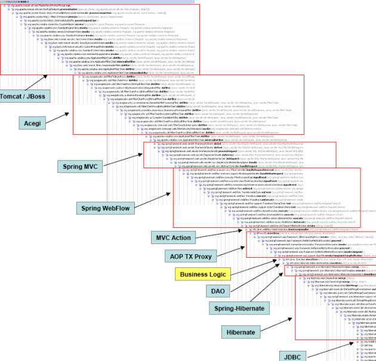

Depend upon __Abstractions__, not _Concretions_

---

tackles rigidity

degradation is often due to poor management of dependencies

change of direction of dependencies comes natural in proper bject-oriented code

---

crash the "abstraction party" when the component is stable

